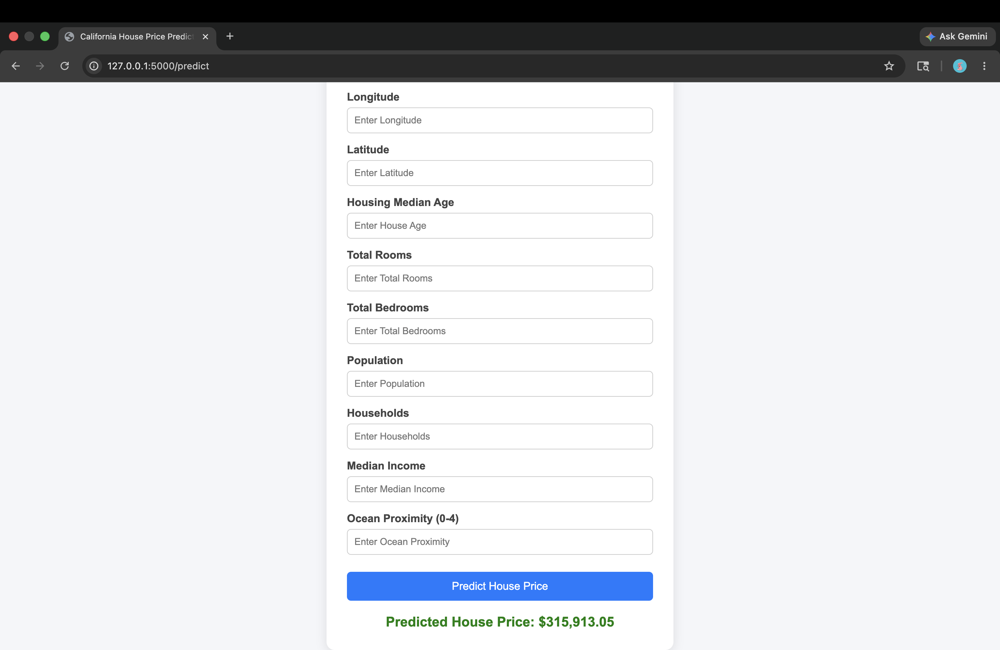
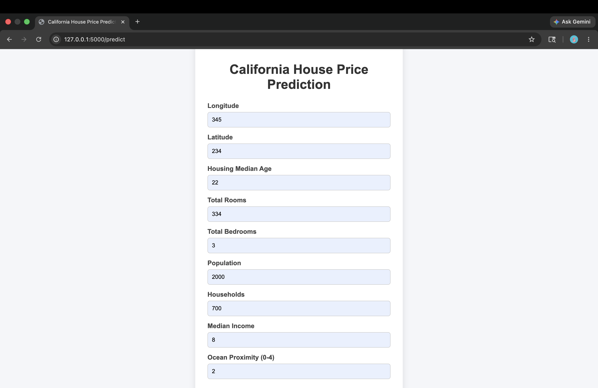
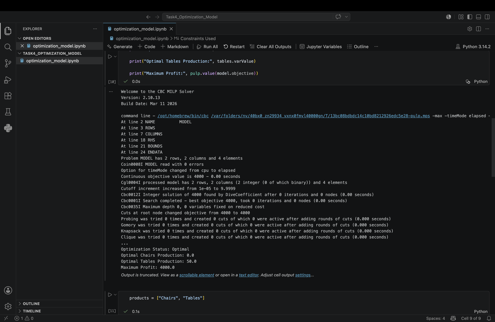
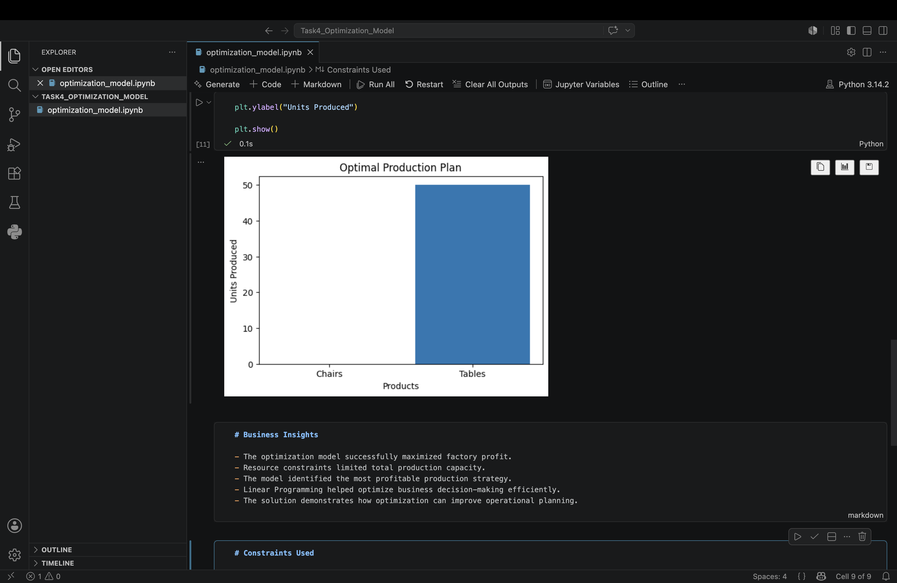

# CODTECH Data Science Internship

This repository contains all tasks completed during the CODTECH Data Science Internship program.

The internship focused on:
- Data preprocessing
- Machine learning
- Deep learning
- Web deployment
- Optimization techniques
- Real-world dataset handling
- Git and GitHub workflow

---

# Tasks Included

## Task 1 - Data Pipeline Development

Developed a complete data preprocessing pipeline using the Titanic dataset.

### Features
- Data cleaning
- Missing value handling
- Label encoding
- Feature scaling
- Data preprocessing automation
- Data visualization

### Technologies Used
- Python
- Pandas
- Scikit-learn
- Matplotlib

---

## Task 2 - Image Classification using Deep Learning

Implemented an image classification model using TensorFlow and Keras on the Fashion MNIST dataset.

### Features
- Deep learning neural network
- Fashion MNIST dataset
- Model training and evaluation
- Accuracy prediction
- Clothing classification
- Image prediction system

### Technologies Used
- Python
- TensorFlow
- Keras
- NumPy
- Matplotlib

---

## Task 3 - California House Price Prediction

Built a complete end-to-end Machine Learning web application using Flask and Random Forest Regression.

### Features
- Large real-world housing dataset
- Data preprocessing and cleaning
- Missing value handling
- Random Forest Regression model
- Flask web application
- Modern HTML/CSS user interface
- Real-time house price prediction

### Technologies Used
- Python
- Pandas
- Scikit-learn
- Flask
- HTML
- CSS
- Joblib

### Screenshots

#### Application Interface



#### Prediction Result



---

## Task 4 - Business Optimization using Linear Programming

Developed an optimization model to maximize factory profit using Linear Programming and the PuLP library.

### Features
- Linear Programming optimization
- Profit maximization
- Resource allocation
- Constraint handling
- Business insights generation
- Production planning visualization

### Technologies Used
- Python
- PuLP
- Pandas
- Matplotlib
- Jupyter Notebook

### Screenshots

#### Optimization Output



#### Production Visualization



---

# Repository Structure

```text
CODTECH_Internship/
│
├── Task1_Data_Pipeline/
│
├── Task2_Image_Classification/
│
├── Task3_House_Price_Prediction/
│   ├── screenshots/
│   └── templates/
│
├── Task4_Optimization_Model/
│   ├── screenshots/
│   └── optimization_model.ipynb
│
├── README.md
└── .gitignore
```

---

# Internship Learning Outcomes

Through these tasks, the following concepts were learned and implemented:

- Data preprocessing and cleaning
- Machine learning workflows
- Deep learning fundamentals
- Flask deployment
- Frontend and backend integration
- Optimization techniques using Linear Programming
- Data visualization
- Real-world dataset handling
- Git and GitHub workflow
- Project structuring and documentation

---

# Tools and Libraries Used

- Python
- Pandas
- NumPy
- Scikit-learn
- TensorFlow
- Keras
- Flask
- PuLP
- Matplotlib
- Joblib
- Jupyter Notebook

---

# Author

Keerthi
